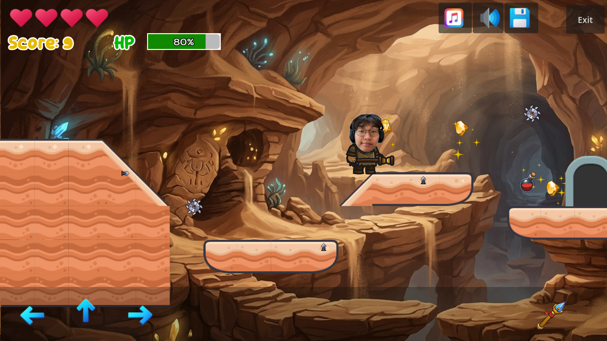
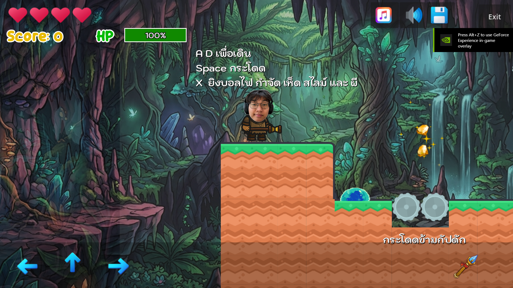

# 🎮 2D Platformer Starter Kit

## 📖 คำอธิบายโครงการ

Starter Kit นี้รวบรวมกลไกพื้นฐานที่จำเป็นทั้งหมดสำหรับการสร้างเกม 2D Platformer แบบสมบูรณ์ด้วย Godot Engine 4.7 ไม่ว่าจะเป็นระบบตัวละครผู้เล่น ศัตรู กับดัก การเก็บไอเท็ม ระบบเลือดและคะแนน ไปจนถึงระบบบันทึกและโหลดเกม

โปรเจกต์นี้ถูกออกแบบมาเพื่อเป็น **สื่อการเรียนรู้แบบลงมือปฏิบัติจริง** สำหรับนักศึกษาที่ลงทะเบียนเรียนรายวิชาการพัฒนาเกมคอมพิวเตอร์ (Computer Game Development) คณะวิทยาการคอมพิวเตอร์ มหาวิทยาลัยขอนแก่น

## ✨ ฟีเจอร์เด่น

- ระบบควบคุมตัวละครผู้เล่น (เดิน กระโดด ยิงกระสุน)
- ระบบศัตรู (Enemy) พร้อมการเดินลาดตระเวนและระบบสุ่มเกิด (Enemy Spawn)
- ระบบกับดัก (Trap) หลากหลายรูปแบบ เช่น หนาม ดาบ กังหัน
- ระบบเก็บไอเท็ม (เหรียญ, ยาฮีล) และคะแนนสะสม
- ระบบเลือด (HP) และจำนวนชีวิต (Life)
- ระบบเมนูเริ่มเกม, ตั้งค่าเสียง, จบเกม (Game Over / Game Win)
- ระบบบันทึกและโหลดเกม (Save / Load)
- ออกแบบด่าน (Level) หลายด่านพร้อมประตูเชื่อมต่อระหว่างด่าน

## 🎥 ตัวอย่างการเล่น (Demo Video)

ดูวิดีโอสาธิตการเล่นเกมได้ที่ 👉 [คลิกเพื่อรับชม](https://drive.google.com/file/d/1eooKx6GzgJVNtlNvqV3fn2knDgGn6y1q/view?usp=sharing)
  

    
    
  

## 🕹️ ทดลองเล่นเกม

ทดลองเล่นเกมเวอร์ชันเว็บได้ทันทีที่ 👉 [krittipatw.github.io/gamegev1-2569-project](https://krittipatw.github.io/gamegev1-2569-project/)

## 🛠️ เทคโนโลยีที่ใช้

- [Godot Engine 4.7](https://godotengine.org/)
- GDScript

## 👤 ผู้จัดทำ

| ชื่อ-นามสกุล | รหัสนักศึกษา |
|---|---|
| นายกฤติพัฒน์ หวังมะโน | 683380065-7 |

---

  จัดทำขึ้นเพื่อการศึกษา รายวิชา Computer Game Development 
  คณะวิทยาการคอมพิวเตอร์ มหาวิทยาลัยขอนแก่น

